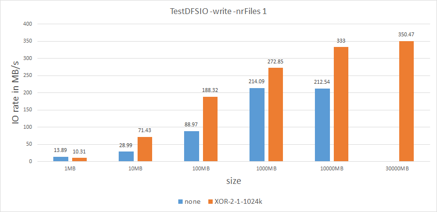
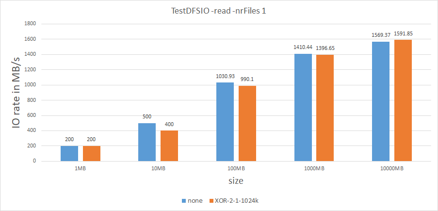
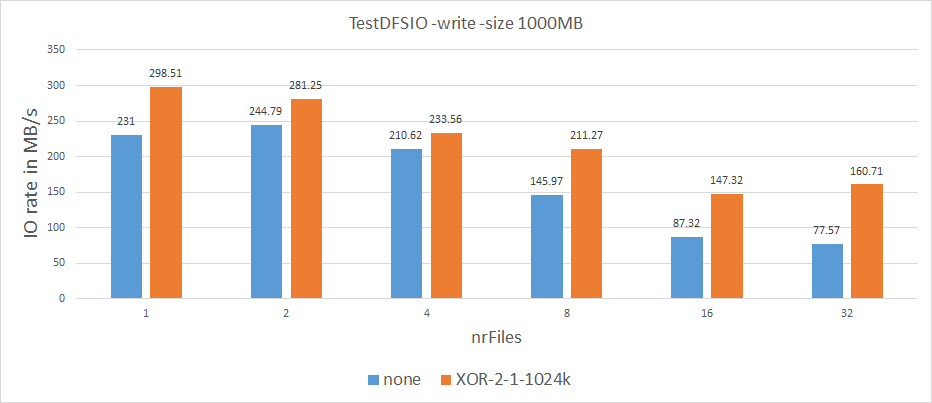
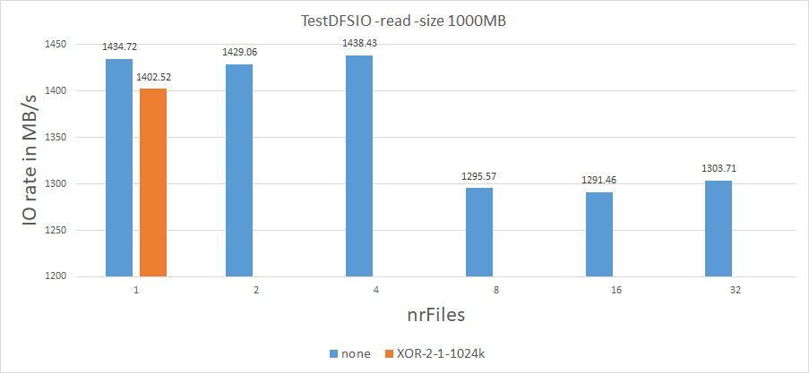

bert_large: 1402 MB

IB write benchmark: (use ib_read_bw & ib_write_bw)

| #bytes | #iterations | BW peak[MB/sec] | BW average[MB/sec] | MsgRate[Mpps] |
| ------ | ----------- | --------------- | ------------------ | ------------- |
| Write  |             |                 |                    |               |
| 65536  | 5000        | 6057.11         | 6056.94            | 0.096911      |
| read   |             |                 |                    |               |
| 65536  | 5000        | 6021.37         | 6021.26            | 0.096340      |

disk io simple test: (use dd)

```shell
[gpzlx1@gpu13 ~]$ time dd if=/dev/zero of=test bs=8k count=10000000
10000000+0 records in
10000000+0 records out
81920000000 bytes (82 GB) copied, 80.8716 s, 1.0 GB/s

real	1m20.874s
user	0m2.225s
sys	1m14.677s

[gpzlx1@gpu13 ~]$ time dd if=test of=/dev/null bs=8k count=10000000
10000000+0 records in
10000000+0 records out
81920000000 bytes (82 GB) copied, 75.2365 s, 1.1 GB/s

real	1m15.239s
user	0m2.301s
sys	0m34.206s
```

#	Time cost

##	scp

```powershell
[gpzlx1@gpu1 ~]$ time scp bert gpzlx1@10.0.0.54:~
bert                                                                                                                100% 1402MB 145.5MB/s   00:09    

real	0m9.890s
user	0m7.956s
sys		0m2.512s
```

##	hadoop

###	hadoop -put

```shell
[gpzlx1@gpu1 ~]$ hdfs dfs -ls
Found 3 items
drwxr-xr-x   - gpzlx1 supergroup          0 2019-08-20 19:21 ec
drwxr-xr-x   - gpzlx1 supergroup          0 2019-08-20 19:21 none
#ec use XOR-2-1-1024k
#none dont use ec
```

* XOR-2-1-1024k

  ```shell
  [gpzlx1@gpu1 ~]$ time hdfs dfs -put bert ec
  2019-08-20 20:07:29,071 WARN erasurecode.ErasureCodeNative: ISA-L support is not available in your platform... using builtin-java codec where applicable
  
  real	0m7.242s
  user	0m15.096s
  sys		0m3.042s
  ```

* none

  ```shell
  [gpzlx1@gpu1 ~]$ time hdfs dfs -put bert none/bert
  
  real	0m8.795s
  user	0m10.225s
  sys		0m2.746s
  ```

| ec            | write time consume | storage comsume     |
| ------------- | ------------------ | ------------------- |
| XOR-2-1-1024k | 7.242s             | 707MB * 3 = 2121MB  |
| none          | 8.795s             | 1402MB * 3 = 4206MB |

###	hdfs -read

* XOR-2-1-1024k

  ```shell
  [gpzlx1@gpu1 ~]$ time hdfs dfs -get ec/bert bert1
  2019-08-20 20:14:47,084 WARN erasurecode.ErasureCodeNative: ISA-L support is not available in your platform... using builtin-java codec where applicable
  
  real	0m7.070s
  user	0m6.282s
  sys		0m3.812s
  ```

* none

  ```shell
  [gpzlx1@gpu1 ~]$ time hdfs dfs -get none/bert bert2
  
  real	0m7.154s
  user	0m5.160s
  sys		0m4.698s
  ```

| ec            | read time consume |
| ------------- | ----------------- |
| XOR-2-1-1024k | 7.070s            |
| none          | 7.154s            |

##	benchmark -use TestDFSIO

> TestDFSIO benchmark is a read and write test for HDFS. It is helpful for tasks such as stress testing HDFS, to discover performance bottlenecks in your network, to shake out the hardware, OS and Hadoop setup of your cluster machines (particularly the NameNode and the DataNodes) and to give you a first impression of how fast your cluster is in terms of I/O.
>
> TestDFSIO is designed in such a way that it will use 1 map task per file, i.e. it is a 1:1 mapping from files to map tasks. Splits are defined so that each map gets only one filename, which it creates (`-write`) or reads (`-read`).

```shell
hadoop jar hadoop-mapreduce-client-jobclient-3.1.2-tests.jar TestDFSIO -read | -write -nrFiles M  -size NMB [-erasureCodePolicy XOR-2-1-1024k] 
#nrFiles: the num of files
#size: the size of files
```




​														**Figure.1: keep nrFiles = 1, writing benchmark**




​														**Figure.2: keep nrFiles = 1, reading benchmark**




​											**Figure.3: keep files size = 1000MB, writing benchmark**




​										**Figure.4: keep files size = 1000MB, reading benchmark**