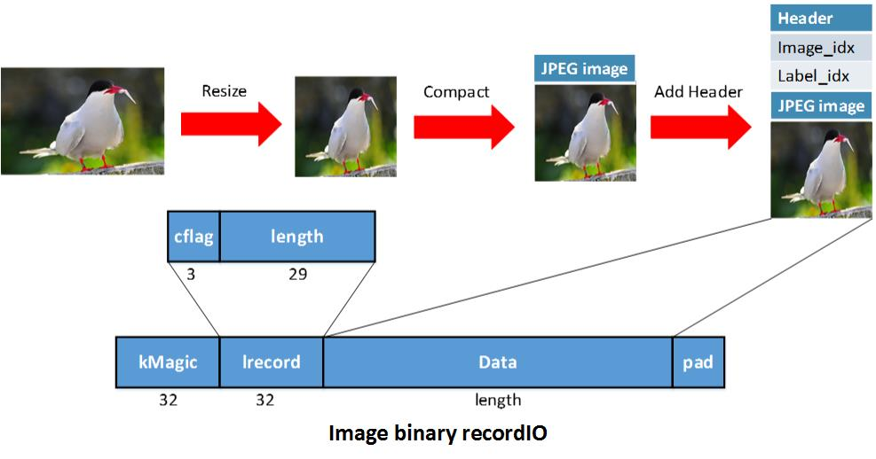

#	Preprocessing

##	CV

the preprocessing of cv is not very complex, it usually contains these methods (optional):

1. rescale or resize
2. crop
3. reshape
4. [ batch ] normalizing
5. standardizing
6. randomly mirror image horizontally to enhance robustness
7. randomly shuffle the data to enhance robustness
8. others

for example in tensorflow **vgg_preprocess** is four steps:

```python
  #_R_MEAN = 123.68
  #_G_MEAN = 116.78
  #_B_MEAN = 103.94

  #_RESIZE_SIDE_MIN = 256
  #_RESIZE_SIDE_MAX = 512
  image = _aspect_preserving_resize(image, resize_side)
  image = _central_crop([image], output_height, output_width)[0]
  image.set_shape([output_height, output_width, 3])
  image = tf.to_float(image)
  return _mean_image_subtraction(image, [_R_MEAN, _G_MEAN, _B_MEAN])
```

**The preprocessing can go on before training or during training.**

In mxnet, data preprocessing can be divided into prepare datas and re-preprocess images. It usually generates the ***.rec** file and ***.lst** file firstly. And during the train, some threads will pre-fetch datas from *.rec and re-preprocess images before each training session.

Using tools/im2rec.py to prepare **.lst** files and **.rec** file

```python
python tools/im2rec.py --list --recursive --train-ratio 0.95 mydata img_data
python tools/im2rec.py --resize 480 --quality 95 --num-thread 16 mydata img_data
#original images become one or more records after resizing, compacting and adding header and pad
```



MXNet can use dataiter to read and re-preprocess the images using `mx.io.ImageRecordIter` API

The following example code demonstrates a Cifar data iterator.

```python
dataiter = mx.io.ImageRecordIter(
    # Dataset Parameter, indicating the data file, please check the data is already there
    path_imgrec="data/cifar/train.rec",
    # Dataset Parameter, indicating the image size after preprocessing
    data_shape=(3,28,28),
    # Batch Parameter, tells how many images in a batch
    batch_size=100,
    # Augmentation Parameter, when offers mean_img, each image will subtract the mean value at each pixel
    mean_img="data/cifar/cifar10_mean.bin",
    # Augmentation Parameter, randomly crop a patch of the data_shape from the original image
    rand_crop=True,
    # Augmentation Parameter, randomly mirror the image horizontally
    rand_mirror=True,
    # Augmentation Parameter, randomly shuffle the data
    shuffle=False,
    # Backend Parameter, preprocessing thread number
    preprocess_threads=4,
    # Backend Parameter, prefetch buffer size
    prefetch_buffer=1,
    # Optional, the device context which data loader optimized for, could be 'gpu' or 'cpu'
    ctx="gpu",
    # The out data type, could be 'float32' 'int8' or 'uint8'
    dtype="float32")
```

###	small summary

There are two data preprocessing schemes in CV

1. Complete most of the processing before training.
2. fetch, preprocess and train work together to form a or more data pipeline.